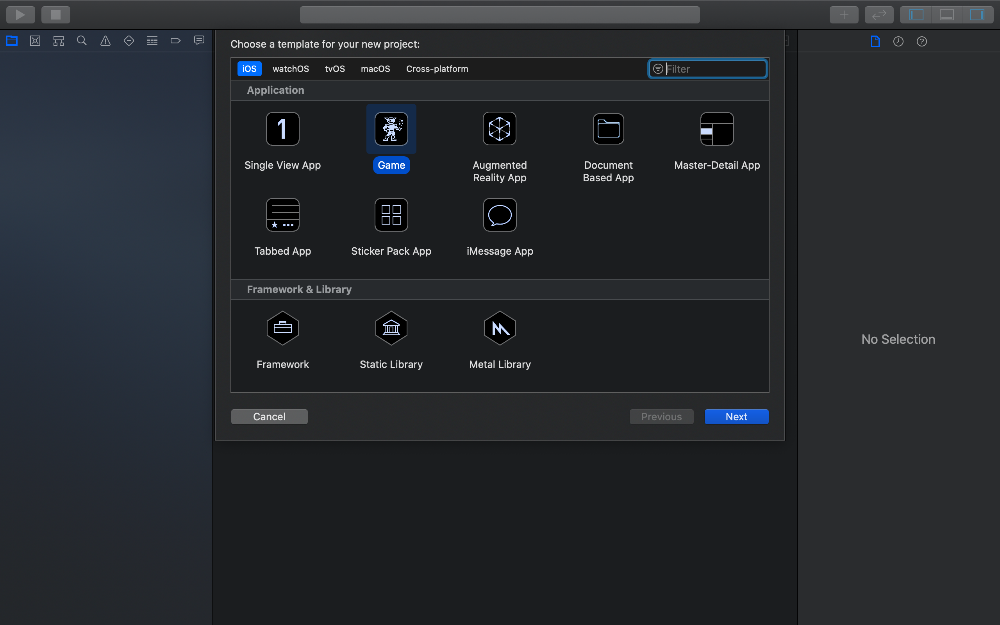
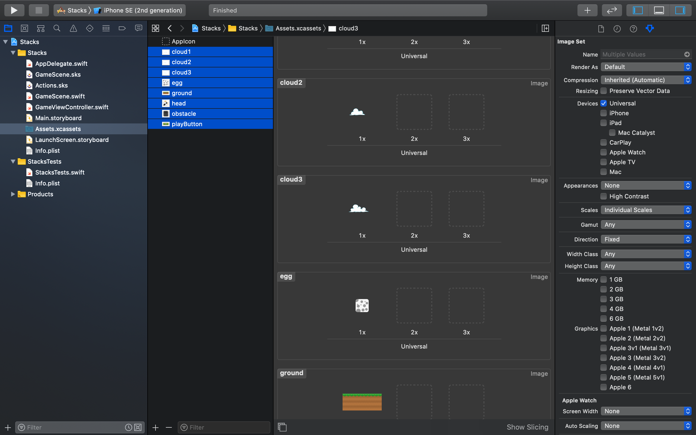

If you have never built a side scroller before, this introduction will help you
understand the basic concepts. You will be tackling this by constructing an
obstacle treadmill. Meaning the obstacles are the ones moving not the player. In this game the player effectively stays in place and must navigate
through the obstacles coming towards them by tapping on the screen and adding a block under the player.

You will learn to implement the following:

- Dynamic obstacle object generation and removal
- Animation and actions
- World scrolling
- Implement physics based collision detection
- Create your own custom reusable button class

# Create a new project

## Time to make a SpriteKit project in Xcode and get started with Stacks!

> [action] Your first step is to create a new SpriteKit Xcode project, open
> Xcode and select `Create a new Xcode project`. Then select
> `iOS > Application > Game` as shown below:
>

>[action]
> On the next screen, Give your product a name (i.e. "Stacks"), and make
> sure you select `Spritekit` as the Game Technology

## Adding artwork

> [action] After the project is created, you should
> [download our art pack for this game](https://github.com/MakeSchool-Tutorials/SquareBird-Clone-Swift5/blob/master/GameAssets.zip).
> Next you will add the art pack you just downloaded to your Xcode project by
> first unpacking the archive. Select the `Assets.xcassets` folder in Xcode
> project navigator, then drag the downloaded assets into Xcode as shown below:
>

## Asset Scale

This would be good time to touch on the subject of asset scale. You may have
noticed when you select an asset in **Assets.xcassets** you are presented with
_1x 2x 3x Scale_ options and by default they will be set to _1x Scale_ as the
filename contains no implied scale e.g. `@2x` or `@3x`

Have a look at this handy
[Device resolution guide](http://www.paintcodeapp.com/news/ultimate-guide-to-iphone-resolutions)

In particular look at the _Rendered Pixels_ section and notice the reference to
scale factor. These assets were designed for retina 1x resolution devices.

# Summary

Great, you've setup a basic project and added the artwork! In the next section
it's time to start building our game. This is also a great spot to make your first git push if you have not already.
