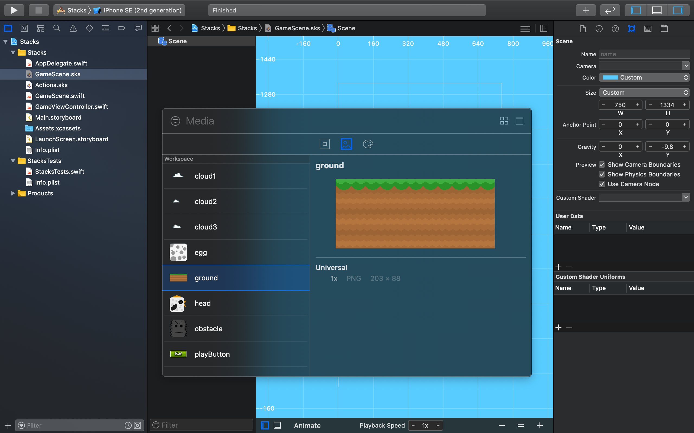

Let's get started setting up the main game scene, SpriteKit Scene Editor is a
powerful Xcode tool that lets you rapidly layout the scene.

# Setting the stage

> [action] Select `GameScene.sks` from the _Project navigator_:
>
> It's helpful to see the scene size, zoom out so you can see the white border
> which represents the scene size. Select `Editor / Zoom Out` or use the
> shortcut shown.
>
> The default project may have a Label in the center with the Text "Hello
> World". Click it to select it and press `delete` on the keyboard.
>
> Next modify the size parameters as shown in the _Attributes inspector panel_
> set width to 750 and height to 1334 `(width: 750, height: 1334)`
>


Remember the device resolution guide in the previous chapter? You will be using
a common design size of 750 x 1334, this gives you a nice portrait view,
perfectly suited to the artwork. You may be wondering what about supporting
other devices?

Thankfully SpriteKit has your back and can automatically scale the view to fit
other devices. This size will scale to fit iPhone 8 through 11.

> [info] Have a look through the code in `GameViewController.swift`. In
> particular:
>
```
/* Set the scale mode to scale to fit the window */
>
scene.scaleMode = .aspectFill
```
>
> If you `option+click` _scaleMode_ and look at the _Quick Help inspector_ panel
> you can find out more about the scaling options available.

## Move the center to the lower left

To make it easier to position objects on the screen you will move the center
point of the scene to the lower left.

> [action] Set Anchor Point of both x and y to 0.
>


# Setting up the GameScene.swift
>[action] Open up GameScene.swift and delete eveything
> except the touchesBegan method and the update method. While you're here also override the sceneDidLoad Method.

The GameScene file should now look like this


# Set the Background Color

Lets go back to the level editor`GameScene.sks` and make the game look a little more lively. Let's change the background color
to a better color.

> [action] With `GameScene.sks` set the color by clicking the color selector
> near the top of the property inspector. Set the color to a nice sky blue. You
> can use your own color or use the _System Teal Color_ as used in the image below.


# Add the ground image

> [action] Open the media library by pressing _Command+Shift+L_ Scroll through
> the object library and drag an _Empty_ node into the scene.
>


>[action]
> Set the position to `(0,0)` since it wont be visible to the player and we want it out of the way.
> Name the empty Node _scrollNode_ this will be import later

-

>[action]
Once you have the empty node setup press _Command+Shift+L_ again but this time you will go to the media tab and find the image named _ground_ drag the image into the scene and set the parent equal to the _scrollNode_.

> With the ground image selected head over to the property editor, go down to Physics Definition >> Body Type and set it to `Bounding Rectangle`. After setting it, options will appear below it. Make sure all of them are _Unchecked_



>[action] Once that's done look over at the property editor and edit the ground's position to `(423,46)`, Copy it and paste it to create another ground node. this time you'll notice that the parent is already to the _scrollNode_ so we don't have to do that well just edit the position and set it to `(1266,46)`.
>


Now we are done setting up the ground.
You'll notice the ground image extends beyond the screen border. Don't worry
about it, you will be scrolling the ground later to create that endless runner
effect.

# Add the clouds

> [action] Just like the ground go back to the media library and drag the cloud images into the scene. There should be three different cloud images place them wherever you think they will look nice. `To make sure they move you can set the parent to be the scrollNode`
>
> If you want to get fancy you can make another emptyNode and call it cloudScroll to make the clouds scroll at a different speed. giving them the effect of distance.
>


# Add the player

> [action] Open the media library again and drag the player image onto the scene.
>
> You may not be able to see the player, if not `Zoom Out` the scene, center your
> view on the the square chicken and then `Zoom In` a little.
>
> You will be connecting the player in code later so you need a way to reference
> it. This is typically done using the _Name_ property, so set _Name_ to `player`.
> Make sure you also set the _Position_ to `(180, 420)` or whatever seems appropriate to you.
> set the _Anchor Point_ to `(0.42, 0.42)` This is because our player is `120x120` but our physics body will be `100x100` because we don't want the top orange part to collide with anything.
>

# Add the assets for terrain generation
>[action]
> Just like the ground we will need an _Empty_ Node so open up the object libray and drag an emptyNode into the scene. Name it obstacleSpawner and set the position to `(750,0)`


Now we can get started adding what will generate our level.

> [action] Open the media library again and drag the the obstacle image onto the scene. Set the _Parent_ property to `obstacleSpawner` an then
> set the position to `(173,281)` this migh be a little different for everyone. just make sure it snaps to the ground.
Now set the _Name_ property to `spawnBlock-8` naming here is very important so I'd advice sticking to the naming I provide.
>
Make sure you go down to where it says Physics Definition, Set the body type to Bounding Rectangle and _uncheck_ all of the boxes


>[action]
> Once you have that first obstacle placed copy and paste 8 more they should all be one of top of the other. The X position should not change, and the Y position should only go up in increments of 100.
>
> Once again we will access the _Name_ property on all of the obstacles we just added One by one starting at the bottom, we will set the _Name_ to `spawnBlock-8, spawnBlock-7 ... spawnBlock-0 from bottom to the top`.
> Make sure you also set the _Anchor Point_ to `(0.5, 0.5)`
>


> [info] Make sure the obstacleBlocks are in order from 0...8 from top to bottom this is VERY
> important. The future code we are going to write depends on this and will NOT work if it is not in the correct order.


# Final Steps
> [action] all you want to do now is add the play button from the media library and place it wherever it looks nice to you. make sure you name all of the nodes appropriately.
>
> Lastly add a barrier which is just a colored sprite that will act as a simple way of deleting the nodes that leave the screen. name it _frontBarrier_
go down to physics definition >> body type and select Bounding Rectangle. All of the boxes should be _Unchecked_ exept the Dynamic box. finally change the position to `(-160, 755)`
>

This should conclude the scene setup and your scene should look like this.

>[info] To detect contact at least one node needs to be marked Dynamic thats why the barrier has that box checked


 


# Final Final Step
> [action] Make sure you go though and name everything properly.
>

 - The play button should be named `playButton`
 - The ground doesn't need a name but in the property editor the Dynamic, Allow Rotation, Pinned and Affected By Gravity should be _Unchecked_
 - The player should be named `player`
 - The clouds don't need a name nor a physics body
 - the front barrier Should be named `frontBarrier`
 - you should have two empty nodes named `scrollNode`, and `obstacleSpawner`
 - lastly the obstacle tower should be named `obstacleBlock-0 through obstacleBlock-8` from top to bottom meaning spawnBlock-0 is at the top and spawnBlock-8 is at the bottom.


# Summary

The game is already starting to take shape, you learned to:

- Build the layout for your game scene using the SpriteKit Scene Editor.
- This is a great spot to make another commit! you dont want to loose all the hard work you just did.

In the next chapter you will be adding a custom class to you project that you will be able to reuse in any number of future projects!
